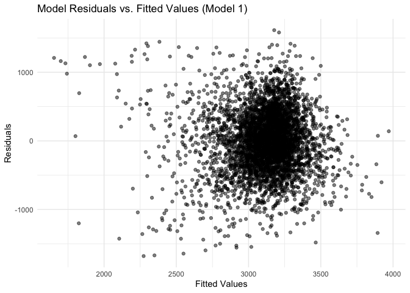
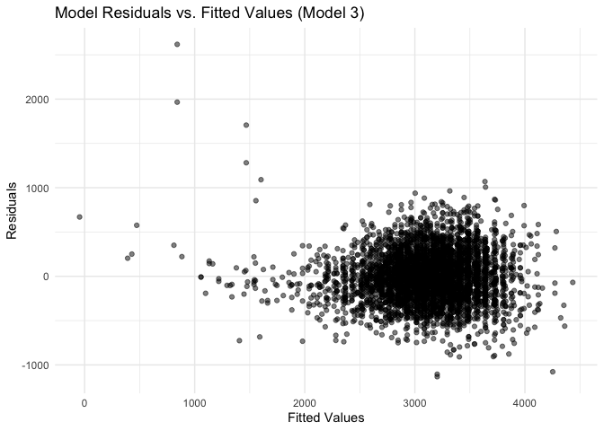
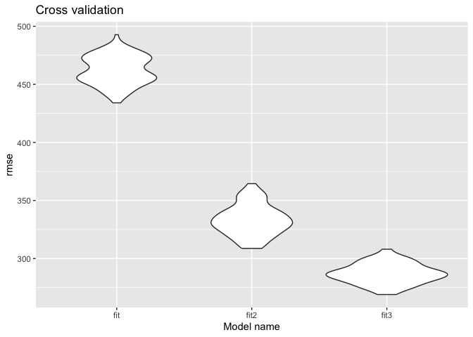

p8105_hw6_sr4081
================
Samiha Reza
2024-12-02

## Probelm 2

``` r
url <- "https://raw.githubusercontent.com/washingtonpost/data-homicides/master/homicide-data.csv"
download.file(url, destfile = "homicide-data.csv")

homicide_data <- read.csv(url) %>%
    janitor::clean_names() %>%
    mutate(city_state = paste(city, state, sep = ", "),
           status = ifelse(disposition %in% c("Closed without arrest", "Open/No arrest"), 0, 1)
)

homicides_race <- subset(homicide_data, !(city_state %in% c("Dallas, TX", "Phoenix, AZ", "Kansas City, MO", "Tulsa, AL")))
homicides_race <- subset(subset(homicides_race, victim_race %in% c("White", "Black")))
homicides_race$victim_age <- as.numeric(homicides_race$victim_age)
```

    ## Warning: NAs introduced by coercion

``` r
homicides_race <- subset(homicides_race, !is.na(victim_age))
```

The dataset has 52179 observations and 14 variables. The variables
include uid, reported_date, victim_last, victim_first, victim_race,
victim_age, victim_sex, city, state, lat, lon, disposition, city_state,
status.

``` r
baltimore_data <- homicides_race %>%
  filter(city_state == "Baltimore, MD")


model <- glm(
  status ~ victim_age + victim_sex + victim_race,
  data = baltimore_data,
  family = binomial(link = "logit")
)

model_results <- broom::tidy(model, conf.int = TRUE, exponentiate = TRUE)

sex_odds_ratio <- model_results %>%
  filter(term == "victim_sexMale") %>%
  select(estimate, conf.low, conf.high)

print(sex_odds_ratio)
```

    ## # A tibble: 1 × 3
    ##   estimate conf.low conf.high
    ##      <dbl>    <dbl>     <dbl>
    ## 1    0.426    0.324     0.558

The estimated OR for the city of Baltimore is 0.4255117 with a
confidence interval of (0.3241908, 0.5575508). The odds of having a
solved homicide case for those who were male is 0.42 times the odds for
a female having a solved homicde case. We are 95% confident that the
true estimate is between (0.3241908, 0.5575508).

``` r
results <- homicides_race %>%
  group_by(city_state) %>%
  nest() %>%  
  mutate(

    model = map(data, ~ glm(
      status ~ victim_age + victim_sex + victim_race,  
      data = .x,
      family = binomial(link = "logit")
    )),
    

    tidy_model = map(model, ~ broom::tidy(.x, conf.int = TRUE, exponentiate = TRUE))
  ) %>%

  unnest(cols = tidy_model) %>%

  filter(term == "victim_sexMale") %>%
  select(city_state, estimate, conf.low, conf.high)
```

``` r
results <- results %>%
  arrange(estimate) %>%
  mutate(city_state = factor(city_state, levels = city_state)) 


ggplot(results, aes(x = estimate, y = city_state)) +
  geom_point(color = "blue", size = 3) + 
  geom_errorbarh(aes(xmin = conf.low, xmax = conf.high), height = 0.2, color = "gray") + 
  labs(
    title = "Adjusted Odds Ratios (OR) for Solving Homicides by City",
    x = "Odds Ratio (Male vs Female Victims)",
    y = "City"
  ) +
  geom_vline(xintercept = 1, linetype = "dashed", color = "red") + 
  theme_minimal(base_size = 12) +
  theme(axis.text.y = element_text(size = 8)) 
```

<!-- --> A majority of
cities have a low odds ratio (male vs female) meaning in most cities,
there are more solved homocides of women. Exceptions are Stockton, CA,
Fresno, CA, and Albuquerque, NM.

## Problem 3

``` r
 birthweight <- read.csv("./birthweight.csv", 
              header = TRUE, 
              sep = "," ,
              na = c("NA", "")) |>
              janitor::clean_names() |>
              mutate(across(c(babysex, frace, malform, mrace), as.factor))


birthweight_model <- lm(bwt ~ momage + ppbmi + gaweeks + babysex, data = birthweight)

tidy_model = birthweight_model%>% 
  broom::tidy()

birthweight_pred <- birthweight %>%
  modelr::add_predictions(birthweight_model) %>%
  modelr::add_residuals(birthweight_model)


ggplot(birthweight_pred, aes(x = pred, y = resid)) +
  geom_point(alpha=0.5) +
  labs(
    x = "Fitted Values",
    y = "Residuals",
    title = "Model Residuals vs. Fitted Values (Model 1)"
  ) +
  theme_minimal()
```

<!-- --> I picked
maternal age, pre-partum bmi, gestational weeks, and sex of the baby as
potential factors for my model. This is because age and bmi of a parent
impact surivial rates and birth outcomes which then in turn impacts
gestational weeks. If a baby is born too early, they will have a lower
birthweight. Male babies tend to be smaller than female ones.

``` r
birthweight_model_1 <- lm(bwt ~ blength + gaweeks, data = birthweight)

tidy_model_1 = birthweight_model_1%>% 
  broom::tidy()

birthweight_pred1 <- birthweight %>%
  modelr::add_predictions(birthweight_model_1) %>%
  modelr::add_residuals(birthweight_model_1)


ggplot(birthweight_pred1, aes(x = pred, y = resid)) +
  geom_point(alpha=0.5) +
  labs(
    x = "Fitted Values",
    y = "Residuals",
    title = "Model Residuals vs. Fitted Values (Model 2)"
  ) +
  theme_minimal()
```

<!-- -->

``` r
#comparison model 2
birthweight_model_2 <- lm(bwt ~ bhead * blength * babysex, data = birthweight)


tidy_model_2 = birthweight_model_2%>% 
  broom::tidy()

birthweight_pred2 <- birthweight %>%
  modelr::add_predictions(birthweight_model_2) %>%
  modelr::add_residuals(birthweight_model_2)


ggplot(birthweight_pred2, aes(x = pred, y = resid)) +
  geom_point(alpha=0.5) +
  labs(
    x = "Fitted Values",
    y = "Residuals",
    title = "Model Residuals vs. Fitted Values (Model 3)"
  ) +
  theme_minimal()
```

<!-- --> All
three potential models are very different from each other. They cluster
around (3200, 0) on the graphs with different spreads.

``` r
#CV Training
cv_df1 = crossv_mc(birthweight, n = 100, test = 0.2) %>% 
  mutate(
    train = map(train, as_tibble),
    test = map(test, as_tibble))

cv_df1 = cv_df1 %>% 
  mutate(
    fit_mod  = map(train, \(df) lm(bwt ~ momage + ppbmi + gaweeks + babysex, data = birthweight)),
    fit2_mod  = map(train, \(df) lm(bwt ~ blength + gaweeks, data = birthweight)),
    fit3_mod = map(train, \(df) lm(bwt ~ bhead * blength * babysex, data = birthweight))
  ) %>% 
  mutate(
    rmse_fit = map2_dbl(fit_mod, test, \(mod, df) rmse(model = mod, data = df)),
    rmse_fit2 = map2_dbl(fit2_mod, test, \(mod, df) rmse(model = mod, data = df)),
    rmse_fit3 = map2_dbl(fit3_mod, test, \(mod, df) rmse(model = mod, data = df))
  )

cv_df1 %>%  
  select(starts_with("rmse")) %>%  
  pivot_longer(
    everything(),
    names_to = "model", 
    values_to = "rmse",
    names_prefix = "rmse_") %>%  
  mutate(model = fct_inorder(model)) %>%  
  ggplot(aes(x = model, y = rmse)) + 
  geom_violin() + 
  labs(
    x = "Model name",
    y = "rmse",
    title = "Cross validation"
)
```

<!-- --> The
third model has the lowest error (RMSE), and thus the best fit model.
